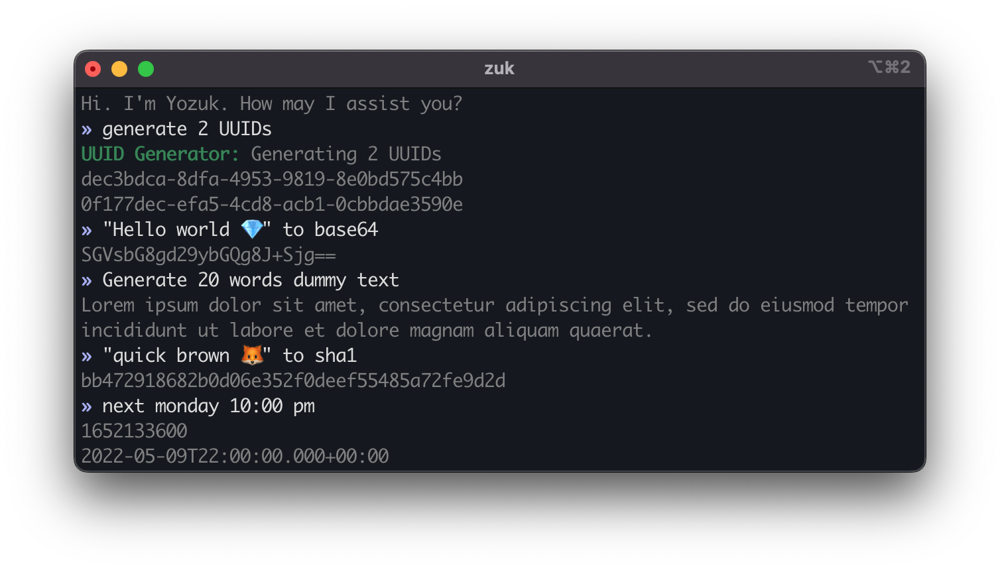

### Yozuk is an assistant bot designed for helping programmers.

Documentation
Launch Web App



## Transparent

Fully open-source, no external dependency, no internet access and no tracking. Your data is completely under your control.

<--->

## Portable

Not to mention WebAssembly support, Yozuk runs natively on Windows, macOS, Linux, Android and iOS.

<--->

## Flexible

Yozuk’s simple text-based interface is lightweight and easy to extend. You can stay in touch with it from any device.


